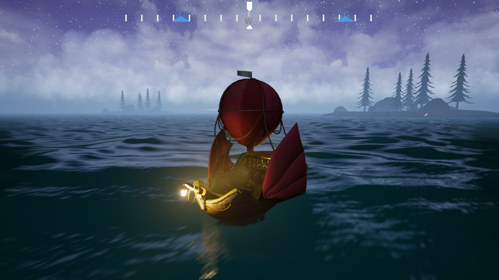

# Hide & Seas
### Presentation
Created during our last year at IMAC engineering school, we present you *Hide & Seas* an infiltration and exploration game.

We developed the game on Unreal Engine 4.26.

Play **Hide & Seas** on [Itch.io](https://art3mma.itch.io/hide-and-seas) !
___
### The team
 
  - [Thomas Zorroché](https://github.com/Thomas-Zorroche)
  - [Felix Olart](https://github.com/Failxxx)
  - [Elo Tassin](https://github.com/Tchikitchi)
  - [Léa Laffitte](https://github.com/Lealaf)
  - [Luc Pinguet](https://github.com/lucpng)
  - [Emma Vodable](https://github.com/emmavbl)

Sounds and musics by : [Mathieu Preux](http://www.mathieupreux.com/)
___
### Screenshots

